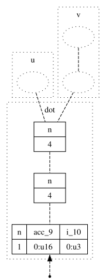
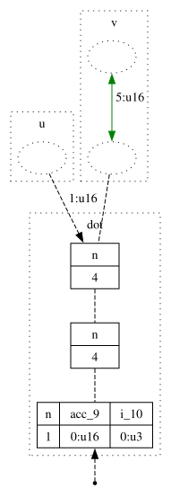
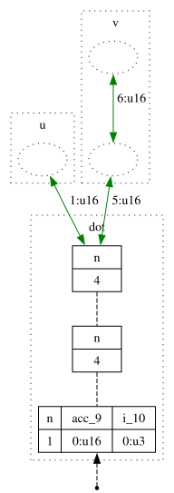
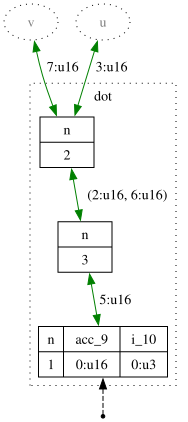
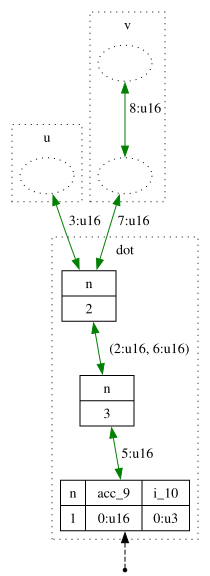
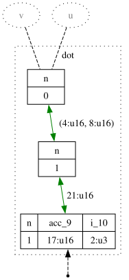
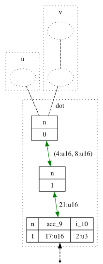
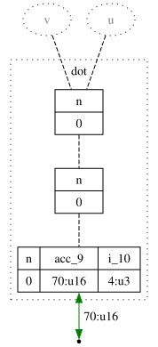
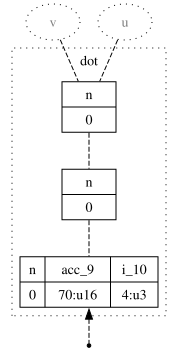

# Sirop

Sirop is a language and compiler for generating streaming accelerators.
Its goal is to convert high-level code (e.g., for image processing or machine learning) into resource-efficient VHDL.

## Installing

The [Releases tab](https://github.com/louis-hildebrand/sirop-hls/releases) has executable .jar files.
Download the .jar file and run it with

```sh
java -jar sirop.jar --version
```

For convenience, you could define an alias like

```sh
alias sirop='java -jar /absolute/path/to/sirop.jar'
```

and then run

```sh
sirop --version
```

To quickly see what an expression evaluates to, try the REPL:

```sh
$ sirop
Welcome to the Sirop REPL (v2.0.0)!
Type 'exit' or press Ctrl+D to exit.
> u = [1:u8, 2:u8, 3:u8, 4:u8]s
> v = [5:u8, 6:u8, 7:u8, 8:u8]s
> StmZip(u, v).StmMap( @(x, y) => x * y ).StmSum()
[70:u8]s
```

For help with the command-line interface, run

```sh
sirop --help
```

### Syntax Highlighting

A Vim plugin providing basic syntax highlighting can be found at [github.com/louis-hildebrand/sirop-vim](https://github.com/louis-hildebrand/sirop-vim).

## Introduction

Sirop is built on the idea of processing _vectors_ and _streams_ of data.
A _vector_ is a sequence whose elements can all be accessed at once.
A _stream_ is a sequence whose elements can only be accessed one at a time, with no way of accessing previous values or skipping upcoming values.
In software terms, a stream is a bit like an iterator.
In hardware terms, a stream is an inherently sequential sequence which produces at most one element per clock cycle.
Vectors, by contrast, can be used in combinational circuits.

Programs transform vectors and streams using "parallel patterns" from the functional programming paradigm.
For example, many languages have a higher-order function called `map` that applies a function to each element of a collection.

```javascript
> // JavaScript
> [1, 2, 3, 4].map(x => x + 5)
[ 6, 7, 8, 9 ]
```

In Sirop, you can transform each element of a vector using `VecMap`:

```
> [1:u8, 2:u8, 3:u8, 4:u8]v.VecMap(x => x + 5)
[6:u8, 7:u8, 8:u8, 9:u8]v
```

This will result in four adders being instantiated to process all the vector's elements in parallel.
Similarly, you can transform each element of a stream using `StmMap`:

```
> [1:u8, 2:u8, 3:u8, 4:u8]s.StmMap(x => x + 5)
[6:u8, 7:u8, 8:u8, 9:u8]s
```

In this case, only one adder will be needed because the stream yields just one element per clock cycle.
It's also possible to partially parallelize this code by representing the input as a stream of vectors:

```
> [[1:u8, 2:u8]v, [3:u8, 4:u8]v]s.StmMap(v => v.VecMap(x => x + 5))
[[6:u8, 7:u8]v, [8:u8, 9:u8]v]s
```

Here, the stream will yield two elements per cycle and there will be two adders to process them.
This idea of using types to represent the level of spatial parallelism appears in prior works, including [Lift-HLS](https://doi.org/10.1145/3315454.3329957), [Aetherling](https://doi.org/10.1145/3385412.3385983), and [SHIR](https://doi.org/10.1145/3501768).

## Example: Dot Product

As a simple example, consider the [dot product](https://en.wikipedia.org/wiki/Dot_product) of two streams.
This can be expressed as follows in Sirop:

```
// u and v are streams of 16-bit unsigned integers, each with length 4
accelerator dot = (u: Stm[u16, 4]) => (v: Stm[u16, 4]) =>
    // EXAMPLE: u = [1:u16, 2:u16, 3:u16, 4:u16]s
    // EXAMPLE: v = [5:u16, 6:u16, 7:u16, 8:u16]s
    StmZip(u, v)
    // EXAMPLE: [(1:u16, 5:u16), (2:u16, 6:u16), (3:u16, 7:u16), (4:u16, 8:u16)]s
    .StmMap( @(x, y) => x * y )
    // EXAMPLE: [5:u16, 12:u16, 21:u16, 32:u16]s
    .StmSum()
    // EXAMPLE: [70:u16]s

assert {
    // when the inputs are...
    u = [1:u16, 2:u16, 3:u16, 4:u16]s,
    v = [5:u16, 6:u16, 7:u16, 8:u16]s
}
// ... then we expect the following output
yields [70:u16]s
```

### Testing and Debugging

The Sirop compiler can test the high-level code directly, without translating it to VHDL:

```sh
$ sirop -i dot.sirop --out:test
[INFO ] test 0: PASSED
[INFO ] 1/1 test passed!
```

If you had accidentally used addition instead of multiplication in `StmMap`, the test would fail:

```sh
$ sed -i 's/x \* y/x + y/g' dot.sirop && \
> sirop -i dot.sirop --out:test ; \
> sed -i 's/x + y/x \* y/g' dot.sirop
[WARN ] test 0: WRONG OUTPUT
TestError: 1/1 test failed.
```

The Sirop compiler can also generate a cycle-by-cycle trace of the execution of the program.
For example, running the following (with the working dot product program):

```sh
# Disable fusion to show each pipeline stage (zip, map, sum).
# By default, the compiler combines everything into a single pipeline stage.
$ sirop -i dot.sirop --out:trace ./trace --opt:no-fuse
```

generates a series of images in `./trace`.

> [!IMPORTANT]
> The images are generated using Graphviz, which must be installed separately.
> See https://graphviz.org/download/.











### Generating VHDL and Running Simulation

Once you're satisfied that the high-level code does what you expect, the Sirop compiler can translate it to VHDL.
It can also generate a testbench to check that the generated VHDL entity behaves the way you expect.

> [!IMPORTANT]
> The testbench is run using Questa.
> The relevant commands (`vcom`, `vsim`, etc.) must be on your `PATH`.
> Furthermore, you may need a license to run `vsim`.

```sh
$ sirop -i dot.sirop --out:vhdl ./hdl --out:vhdl:run-sim
[INFO ] VHDL testbench passed!
```

At this point, you have VHDL code that can be synthesized with Quartus, simulated with your own testbench in Questa, etc.

### More Examples

More example programs can be found in [src/main/resources/mhir/main/stored/](./src/main/resources/mhir/main/stored) and [src/e2e/resources/](./src/main/resources).

## Development

### Documentation

The Sirop intermediate representation is described in a conference paper: https://doi.org/10.1145/3814943.3816175.

Documentation for the Scala code can be generated and opened using the following command (assuming you're in the project root directory).
```shell
sbt doc && open target/scala-2.12/api/index.html
```

There are also rough notes explaining certain design decisions in [notes/](./notes).

### Running the Tests

The following command runs all the tests
```shell
sbt test
```

Some tests involve generating and simulating VHDL or Verilog.
These are tagged with `@mhir.testing.HardwareTest`.
Therefore, the following command will run all tests *except* the hardware tests.
```shell
sbt 'testOnly * -- -l mhir.testing.HardwareTest'
```

Or, conversely, run *only* the hardware tests with
```shell
sbt 'testOnly * -- -n mhir.testing.HardwareTest'
```

Running the VHDL tests requires a VHDL compiler and simulator.
This project was tested using Quartus Prime Lite 21.1.
The test suite `TestRunnerTests` verifies that VHDL can be compiled and simulated.
```shell
sbt 'testOnly *TestRunnerTests'
```

Similarly, run *only* the performance tests with
```shell
sbt 'testOnly * -- -n mhir.testing.PerformanceTest'
```

### Logging

Logging is performed via the scala-logging library with the logback backend.
The log level can be adjusted in [logback.xml](./src/main/resources/logback.xml).

### Debugging

There are some classes that help with debugging in [the debug package](./src/main/scala/mhir/debug).
Consult the package documentation for more information.

### Git Pre-Commit Hook

A Git pre-commit hook is available to check formatting and run some of the tests ([githooks/pre-commit](./githooks/pre-commit)).
The following command installs it.
```shell
git config core.hooksPath githooks
```

### Creating a Release

A new release can be created by first updating the version in [src/main/resources/version.txt](./src/main/resources/version.txt) and then running [release.sh](./release.sh).
